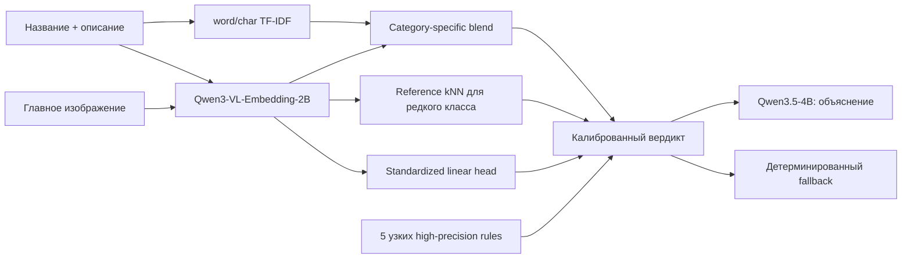

# E-CUP 2026 — контроль качества товаров Ozon

Воспроизводимое multimodal-решение задачи №2. По названию, описанию и изображениям товара pipeline определяет, соответствует ли карточка правилам категории `БАД` или `Легковоспламеняющиеся`, а затем формирует обязательный комментарий и вердикт `бан / не бан`.

**Лучший подтверждённый public score: `0.8142217631` (v45); на private leaderboard решение вошло в топ-8.** Это v19-ансамбль TF-IDF + Qwen3-VL + leakage-safe reference kNN, дополненный небольшой стандартизованной головой и пятью высокоточными правилами без exact-title lookup.

Точный отправленный runtime вместе с classifier artifact сохранён в
[`final_submission/`](final_submission/). Его происхождение и контрольные суммы:
[`FINAL_SUBMISSION.md`](FINAL_SUBMISSION.md).

## Идея решения



Архитектура обусловлена данными, а не выбрана заранее:

- у `БАД` 5 564 положительных примера, поэтому хорошо работает устойчивый lexical/VLM blend;
- у `Легковоспламеняющиеся` только 198 положительных примеров из 5 502, поэтому отдельный reference kNN лучше сохраняет редкие товарные семейства;
- генерация комментария отделена от классификации и не может изменить вердикт;
- пороги и веса фиксируются на group OOF до full-data refit.

Подробное устройство и формулы: [SOLUTION.md](SOLUTION.md).

## Результаты

| Версия | Проверка | Score | Решение |
|---|---|---:|---|
| text v2 | fixed entity holdout | 0.756857 | baseline |
| reference VLM v8 | fixed entity holdout | 0.788047 | исправлен image/model contract |
| full OOF v9 | public | 0.745090 | отклонён: сдвиг порога |
| frozen-decision refit v10 | public | 0.793388 | принят |
| reference kNN v19 | public | 0.808892 | предыдущий лучший; основа v45 |
| title/rules v27 | public | 0.800964 | отклонён: не перенёсся |
| **standardized + 5 узких rules v45** | **public** | **0.814222** | **новый лучший** |

Почему некоторые локально сильные идеи ухудшали public и как менялась система: [EXPERIMENT_JOURNEY.md](EXPERIMENT_JOURNEY.md). Полные числа: [RESULTS.md](RESULTS.md) и машинно-читаемый [experiments.csv](experiments.csv).

## Быстрый старт

Требования: Python 3.11/3.12, `uv`; CUDA нужна только для извлечения Qwen3-VL embeddings и полного inference.

```bash
cd case2
uv sync --extra dev --extra models
uv run pytest
uv run ruff check src tests \
  scripts/build_standardized_head_artifact.py \
  scripts/build_regex_only_artifact.py \
  scripts/verify_final_submission.py
uv run python scripts/verify_final_submission.py
```

Проверка CLI:

```bash
uv run ozon-quality --help
```

## Полное воспроизведение v45

Данные размещаются как `data/data.csv` и `data/images/<id>/*`. Веса моделей берутся из разрешённого организаторами каталога и не хранятся в Git.

```bash
# 1. Одинаковая группировка сущностей для split и full refit
uv run ozon-quality official-group-data \
  --input data/data.csv --schema configs/ozon_schema.json \
  --output data/full_grouped.csv

# 2. Зафиксированный leakage-aware holdout
uv run ozon-quality official-split \
  --input data/data.csv --schema configs/ozon_schema.json \
  --train-output data/train.csv --valid-output data/valid.csv \
  --seed 42

# 3. Category-specific lexical OOF
uv run ozon-quality official-text-baseline \
  --train data/train.csv --valid data/valid.csv \
  --schema configs/ozon_schema.json --output artifacts/text_v2 \
  --seed 42 --oof-folds 5

# 4. Model-card Qwen3-VL contract: joint input, last-token pooling
uv run ozon-quality official-reference-embed \
  --input data/full_grouped.csv --schema configs/ozon_schema.json \
  --model models/Qwen/Qwen3-VL-Embedding-2B \
  --output artifacts/reference_joint_full --mode joint \
  --batch-size 64 --max-pixels 100352

# 5. Выбор blend/threshold только на train OOF, holdout остаётся независимым
uv run ozon-quality official-multimodal \
  --train data/train.csv --valid data/valid.csv \
  --embedding-input data/full_grouped.csv \
  --embedding-cache artifacts/reference_joint_full \
  --lexical-artifacts artifacts/text_v2 \
  --schema configs/ozon_schema.json --output artifacts/multimodal_v8

# 6. Full-data refit с замороженными решениями v8
uv run ozon-quality official-refit \
  --input data/full_grouped.csv \
  --embedding-cache artifacts/reference_joint_full \
  --frozen-artifact artifacts/multimodal_v8/official_multimodal.joblib \
  --schema configs/ozon_schema.json \
  --output artifacts/v10_fullrefit.joblib

# 7. Воспроизводимое присоединение v19 reference bank
uv run ozon-quality official-attach-knn \
  --input data/full_grouped.csv \
  --embedding-cache artifacts/reference_joint_full \
  --base-artifact artifacts/v10_fullrefit.joblib \
  --config configs/v19_knn.json \
  --schema configs/ozon_schema.json \
  --output artifacts/v19_fullrefit.joblib

# 8. Frozen standardized head из versioned v45 config
uv run python scripts/build_standardized_head_artifact.py \
  --base-artifact artifacts/v19_fullrefit.joblib \
  --data data/full_grouped.csv \
  --embedding-cache artifacts/reference_joint_full \
  --config configs/v45.json \
  --output artifacts/v45_linear_intermediate.joblib

# 9. Пять узких правил; exact-title и hard-nearest удалены
uv run python scripts/build_regex_only_artifact.py \
  --base-artifact artifacts/v45_linear_intermediate.joblib \
  --config configs/v45.json \
  --output artifacts/official_multimodal.joblib
```

Подробности об окружении, контрольных хэшах и A100 smoke: [REPRODUCIBILITY.md](REPRODUCIBILITY.md).

## Inference

Официальный entry point:

```bash
SHARED_MODELS_PATH=/shared_models python -u run.py \
  -i /path/to/test.csv \
  -o /path/to/predictions.csv
```

Runner:

1. извлекает joint embeddings из текста и главного изображения;
2. применяет frozen lexical/VLM/kNN ensemble, standardized head и пять правил;
3. генерирует объяснение через `Qwen3.5-4B`;
4. при ошибке LLM использует детерминированный fallback; границы его доказательности описаны в [COMMENT_QUALITY.md](COMMENT_QUALITY.md);
5. проверяет порядок ID и строгий формат `id,result`.

## Карта репозитория

| Путь | Назначение |
|---|---|
| [src/ozon_quality](src/ozon_quality) | data contract, split, обучение, inference |
| [run.py](run.py) | offline entry point соревнования |
| [configs/ozon_schema.json](configs/ozon_schema.json) | каноническое отображение колонок |
| [configs/v19_knn.json](configs/v19_knn.json) | замороженные параметры reference kNN |
| [configs/v45.json](configs/v45.json) | финальная standardized head и безопасные правила |
| [tests](tests) | parsing, leakage, metric, artifact и output-contract тесты |
| [scripts](scripts) | финальные builders и архив ablation/research экспериментов |
| [experiments.csv](experiments.csv) | полный журнал принятых и отклонённых гипотез |
| [DATA_AUDIT.md](DATA_AUDIT.md) | аудит данных и дисбаланса |
| [VALIDATION.md](VALIDATION.md) | split, leakage checks и ограничения оценки |
| [MODELS.md](MODELS.md) | модели, revisions, лицензии и роли |
| [FINAL_SUBMISSION.md](FINAL_SUBMISSION.md) | точный v45 snapshot и контрольные суммы |
| [COMMENT_QUALITY.md](COMMENT_QUALITY.md) | полезность комментариев и границы доказательности |
| [THIRD_PARTY_NOTICES.md](THIRD_PARTY_NOTICES.md) | лицензии моделей и основных библиотек |

## Рекомендуемый порядок чтения для ревью

1. [FINAL_SUBMISSION.md](FINAL_SUBMISSION.md) — какой именно код и artifact оценивались.
2. [SOLUTION.md](SOLUTION.md) — что именно делает финальная система.
3. [EXPERIMENT_JOURNEY.md](EXPERIMENT_JOURNEY.md) — как я к ней пришёл и почему отбрасывал идеи.
4. [VALIDATION.md](VALIDATION.md) — почему локальным числам можно или нельзя доверять.
5. [REPRODUCIBILITY.md](REPRODUCIBILITY.md) — как повторить обучение и inference.
6. [COMMENT_QUALITY.md](COMMENT_QUALITY.md) — что комментарии доказывают и чего не доказывают.
7. [JURY_PITCH.md](JURY_PITCH.md) — сценарий 5–7-минутной защиты и ответы на вопросы.
8. [experiments.csv](experiments.csv) — первичный журнал всех запусков.

## Ограничения

- Всего 113 независимых положительных entity groups категории воспламеняемых; variance между folds остаётся высоким.
- Шаблонные описания и противоречивые товарные семейства создают label noise.
- Public leaderboard использовался как внешняя проверка готовых версий, а не как источник обучающих labels; v27 показал риск lookup-переобучения, а v45 подтвердил перенос более консервативной надстройки.
- `joblib`-артефакты следует загружать только из доверенного источника.
