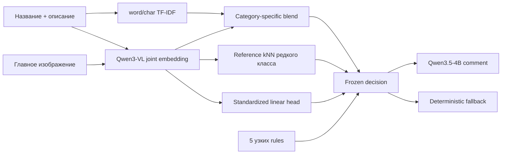

# E-CUP 2026 · Контроль качества товаров Ozon

[](https://github.com/falexsun/E-CUP-2026-CASE2/actions/workflows/quality.yml)

Воспроизводимое мультимодальное решение задачи №2. По названию, описанию и
главному изображению товара система определяет соответствие правилам категории
`БАД` или `Легковоспламеняющиеся`, затем формирует комментарий для модератора и
строгий вердикт `бан / не бан`.

Официальные источники: [постановка и формат решения](https://ods.ai/competitions/e-cup-2026-quality),
[данные, правила категорий и разрешённые модели](https://ods.ai/competitions/e-cup-2026-quality/dataset).

| Итог | Значение |
|---|---|
| Финальная версия | `v45` |
| Public Macro F1 | **0.8142217631** |
| Private Macro F1 | **0.8644397759 · топ-8** |
| Runtime-модели | Qwen3-VL-Embedding-2B + Qwen3.5-4B |
| Лицензии моделей | Apache-2.0 |
| Точный submission | [`final_submission/`](final_submission/) |
| Проверка репозитория | `make quality` |

## С чего начать проверку

Главный рассказ находится на этой странице. Для технической проверки достаточно
трёх документов:

1. [SOLUTION.md](docs/SOLUTION.md) — архитектура, выбор kNN и вклад каждого слоя;
2. [VALIDATION.md](docs/VALIDATION.md) — group split, статистические ограничения
   и корректная интерпретация leaderboard;
3. [REPRODUCIBILITY.md](docs/REPRODUCIBILITY.md) — точный submission, команды и
   границы фактически выполненного воспроизведения.

История экспериментов, лицензии и аудит комментариев оставлены как
[приложения](docs/README.md), а не как обязательный маршрут чтения.

## Почему решение устроено именно так



- В категории `БАД` 5 564 положительных примера: устойчиво работает сочетание
  lexical и joint VLM признаков.
- В категории `Легковоспламеняющиеся` только 198 положительных строк и 113
  независимых positive groups: поэтому используется отдельный reference kNN.
- Пороги и веса фиксируются по group OOF до full-data refit.
- Генератор комментария получает уже готовый label и не может изменить метрику
  классификатора.

### Почему для редкого класса выбран kNN

У воспламеняемых всего 198 positives, распределённых по 113 entity groups, и
класс состоит из разных локальных семейств: зажигалки, газ, топливо, уголь и
комплекты. Одна линейная граница сглаживала такие семейства. Reference kNN
добавляет разность cosine similarity до ближайших положительных и отрицательных
train-примеров в уже рассчитанном Qwen3-VL пространстве.

| Альтернатива | Leakage-aware результат | Вывод |
|---|---:|---|
| Base blend v10 | public `0.793388` | сильная основа, но теряет редкие семейства |
| Reference kNN v19 | public `0.808892` | `+0.015504`, выбран |
| RBF SVC | flammable outer F1 `0.674221` | не изменил решения относительно v19 |
| Qwen3.5 hidden head | flammable outer F1 `0.676140` | прирост слишком мал для второй модели |
| Qwen3-VL LoRA | hard-fold AP `0.209187` против `0.363317` у v19 | переобучение |

kNN не требует второй neural model на inference: reference bank увеличивает
classifier artifact примерно до 28 МБ, а embeddings запроса используются те же.

## Расширение на новые категории

Финальное решение обучено на двух конкурсных направлениях, но его основа не
является монолитным классификатором только для БАД и воспламеняемых. Общими для
всех направлений остаются:

- schema adapter карточки товара и поиск изображений по `id`;
- entity grouping, group OOF и контроль утечек;
- TF-IDF и joint Qwen3-VL feature extraction;
- кеширование embeddings, full-data refit и offline runtime;
- генерация комментария после фиксированного classifier verdict;
- единый input/output contract и тесты.

Каждая категория получает собственные heads, fusion weights и threshold. Поэтому
новое направление модерации можно добавлять независимо: определить task context,
подготовить размеченные примеры, обучить category head и откалибровать порог, не
переписывая инфраструктуру и не переобучая уже работающие головы.

Это предусмотренная точка расширения, а не экспериментально доказанное качество
на третьей категории и не обещание zero-shot переноса. Новая категория требует
собственных данных, правил и leakage-aware проверки. Подробная граница
переиспользования описана в
[SOLUTION.md](docs/SOLUTION.md#11-расширение-на-новые-категории).

## Что именно дали пять regex

Финал — намеренно гибридная система. ML не является обёрткой вокруг правил:
версия v19 без финальных regex уже получила public `0.808892`. Но и скрывать
роль правил нельзя — на локальном model-selection proxy они дали большую часть
прироста после v19.

| Конфигурация | Flammable outer F1 | Что добавлено к v19 |
|---|---:|---|
| v19 | `0.674221` | ничего |
| v34 | `0.681818` | standardized linear head |
| v44 | `0.768421` | пять regex, без standardized head |
| **v45** | **`0.775726`** | **head + пять regex** |

Эти outer-числа не являются независимой оценкой regex: паттерны были выбраны
после анализа всего released train. Корректное внешнее сравнение доступно только
для полных submission: v19 public `0.808892` и v45 public `0.814222`. На private
отправлялся v45, поэтому private-ablation вклада правил отсутствует.

## Подтверждённая эволюция

| Версия | Проверка | Macro F1 | Вывод |
|---|---|---:|---|
| text v2 | fixed holdout | 0.756857 | сильный дешёвый baseline |
| reference VLM v8 | fixed holdout | 0.788047 | исправлен image/model contract |
| full OOF v9 | public | 0.745090 | отклонён: нестабильный новый threshold |
| frozen refit v10 | public | 0.793388 | решения заморожены до refit |
| reference kNN v19 | public | 0.808892 | основа финальной версии |
| title/rules v27 | public | 0.800964 | отклонён: optimistic lookup не перенёсся |
| **standardized + rules v45** | **public** | **0.814222** | **финальный submission** |
| **standardized + rules v45** | **private** | **0.864440** | **итоговое 8-е место** |

Полный машинно-читаемый журнал: [`experiments.csv`](experiments.csv).

## Точный конкурсный runtime

Каталог [`final_submission/`](final_submission/) извлечён из реально отправленного
ZIP. Он содержит код и обученный classifier artifact, но не содержит базовые
веса Qwen: организаторы предоставляют их через `SHARED_MODELS_PATH`.

```bash
uv run python scripts/verify_final_submission.py
```

Проверяемые SHA-256:

- submission ZIP: `1361b836b6c926e0be0c99689b29238a82d8add53adc7a4e17e537ddbfe12b07`;
- classifier artifact: `e7604e6868e46f673428aebf8439eb87e3875fdfbd8c3c2e4cfd8c7ac7d9d53a`.

## Быстрая проверка репозитория

Требования: Python 3.11/3.12 и [`uv`](https://docs.astral.sh/uv/).

```bash
uv sync --extra dev
make quality
```

Ожидаемый результат:

```text
ruff: all checks passed
pytest: 49 passed, 1 skipped
final v45 snapshot: OK
```

GPU и веса моделей для этих CPU-проверок не нужны. Полное обучение и inference
описаны в [REPRODUCIBILITY.md](docs/REPRODUCIBILITY.md).

## Официальный inference

```bash
SHARED_MODELS_PATH=/shared_models python -u final_submission/run.py \
  --test_data_path /path/to/test.csv \
  --output_path /path/to/predictions.csv
```

Runner гарантирует:

- две колонки `id,result` в исходном порядке;
- формат `<комментарий>...<вердикт>бан|не бан`;
- комментарий длиной 50–300 символов;
- отсутствие сетевых загрузок;
- deterministic fallback при сбое explanation LLM.

## Структура

| Путь | Назначение |
|---|---|
| [`final_submission/`](final_submission/) | точный код и classifier artifact отправленного v45 |
| [`src/ozon_quality/`](src/ozon_quality/) | подготовка данных, split, обучение и inference |
| [`configs/`](configs/) | schema и frozen параметры v19/v45 |
| [`scripts/`](scripts/) | финальные builders и архив абляций |
| [`tests/`](tests/) | metric, leakage, cache, artifact и output-contract tests |
| [`docs/`](docs/) | решение, путь экспериментов, validation и воспроизводимость |
| [`experiments.csv`](experiments.csv) | журнал принятых и отклонённых запусков |

Датасет, изображения, промежуточные caches и базовые веса Qwen не коммитятся.

## Соответствие правилам

- Используются только разрешённые модели до 4B:
  `Qwen/Qwen3-VL-Embedding-2B` и `Qwen/Qwen3.5-4B`.
- Обе модели имеют Apache-2.0; Model IDs и revisions приведены в
  [MODELS.md](docs/MODELS.md).
- Закрытые API и проприетарные модели не используются.
- Inference полностью автономный и рассчитан на официальный baseline image.
- Обученный classifier artifact опубликован; вся цепочка его восстановления
  описана командами и versioned configs.

## Честно зафиксированные ограничения

- Для редкого класса всего 113 positive entity groups, поэтому variance между
  folds остаётся высокой.
- Пять regex v45 отбирались по released train; их outer gain является
  model-selection proxy, а не независимой оценкой. Public использовался при
  выборе версии, поэтому он также не заменяет новый независимый holdout.
- Private в официальном протоколе больше public (`~3800` против `~1600` строк),
  но отдельные category F1 и состав split неизвестны. Разрыв `0.8142 → 0.8644`
  нельзя приписать конкретному компоненту или интерпретировать как оценку шума.
- Explanation LLM видит название и описание, но не пиксели. У fallback есть
  известная зона риска необоснованной ссылки на изображения; она раскрыта в
  [COMMENT_QUALITY.md](docs/COMMENT_QUALITY.md), а точный submission не
  переписывался задним числом.
- `joblib`-артефакт следует загружать только из этого доверенного репозитория.
